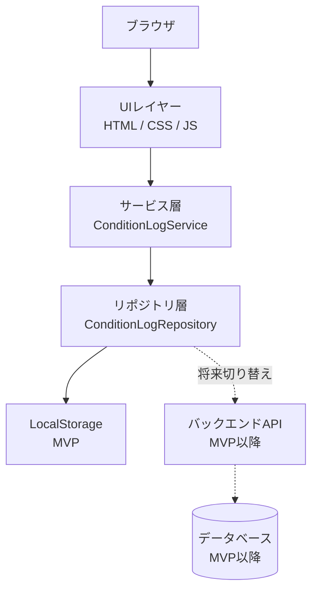
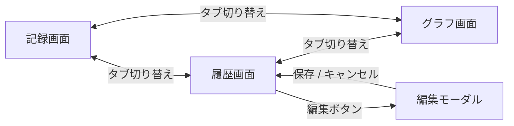

# 機能設計書

## デザインシステム

### デザイン方針

Claudeアプリのような落ち着いたミニマルなトーンを基本とする。
Pico CSSのデフォルトスタイルをベースに、CSS Variablesで上書きしてデザインを統一する。

### デザイントークン

#### カラー

| トークン | 値 | 用途 |
|---------|-----|------|
| `--color-bg` | `#F9F8F6` | ページ背景（温かみのあるオフホワイト） |
| `--color-surface` | `#FFFFFF` | カード・モーダルの背景 |
| `--color-text` | `#1A1A1A` | メインテキスト |
| `--color-text-sub` | `#6B7280` | サブテキスト・ラベル |
| `--color-accent` | `#8B5CF6` | アクセント・選択状態（パープル） |
| `--color-accent-light` | `#EDE9FE` | 選択状態の背景色 |
| `--color-border` | `#E5E7EB` | ボーダー・区切り線 |
| `--color-error` | `#EF4444` | エラーメッセージ |
| `--color-success` | `#10B981` | 記録済みバッジ |

#### タイポグラフィ

| トークン | 値 | 用途 |
|---------|-----|------|
| `--font-family` | `'Inter', sans-serif` | 全体フォント |
| `--font-size-base` | `16px` | 本文 |
| `--font-size-sm` | `14px` | サブテキスト・ラベル |
| `--font-size-lg` | `20px` | セクション見出し |

#### 余白・形状

| トークン | 値 | 用途 |
|---------|-----|------|
| `--spacing-sm` | `8px` | 要素内の小余白 |
| `--spacing-md` | `16px` | 基本余白 |
| `--spacing-lg` | `24px` | セクション間余白 |
| `--radius` | `10px` | ボタン・カードの角丸 |
| `--shadow` | `0 1px 3px rgba(0,0,0,0.08)` | カードの影 |

### コンポーネントのスタイル方針

| コンポーネント | スタイル方法 | 備考 |
|--------------|------------|------|
| ページレイアウト・テキスト・テーブル | Pico CSS デフォルト | そのまま使用 |
| 5段階評価ボタン | カスタムCSS | 数字ボタン・選択状態をカスタム実装 |
| 勤務状態セグメントボタン | カスタムCSS | 4択ボタングループをカスタム実装 |
| 記録済みバッジ | カスタムCSS | `--color-success` を使用 |
| ボトムナビゲーション | カスタムCSS | 下部固定・タブ切り替えをカスタム実装 |
| 編集・削除ボタン | Pico CSS ベース + カスタム | Pico のボタンスタイルを上書き |

---

## システム構成図



---

## 画面構成と遷移図

3つの画面をボトムナビゲーション（タブ）で切り替えるSPA構成。スマートフォン・PCともに同じレイアウトを使用し、実装のシンプルさを優先する。



---

## データモデル定義

### ConditionLog（コンディションログ）

1日1件のコンディション記録を表すデータ構造。同じ日付で保存した場合は上書きとなる。

| フィールド | 型 | 必須 | 説明 |
|-----------|-----|:----:|------|
| `id` | string (UUID) | ✓ | 一意識別子 |
| `logDate` | string (YYYY-MM-DD) | ✓ | 記録日（1日1件のキー） |
| `updatedAt` | string (ISO 8601) | ✓ | 最終更新日時（システム自動付与・ユーザー非表示） |
| `mental` | number (1–5) | ✓ | メンタル評価 |
| `skin` | number (1–5) | ✓ | スキン評価 |
| `brainFatigue` | number (1–5) | ✓ | 脳疲労評価 |
| `workStyle` | string (enum) | ✓ | 勤務状態 |
| `memo` | string | － | 自由メモ（任意） |

#### workStyle の列挙値

| 値 | 表示ラベル |
|----|----------|
| `remote` | 在宅 |
| `office` | 出社 |
| `business_trip` | 出張 |
| `day_off` | 休み |

#### メトリクスのレベル定義

**メンタル**

| レベル | 定義 |
|-------|------|
| 1 | 焦燥感、もう無理感あり |
| 2 | 予兆あり |
| 3 | 安定 |
| 4 | 前向き |
| 5 | 躁傾向 |

**スキン**

| レベル | 定義 |
|-------|------|
| 1 | 全身不調 |
| 2 | 部分的に不調 |
| 3 | 回復傾向 |
| 4 | 一部出てるが気にならない |
| 5 | 出てない |

**脳疲労**

| レベル | 定義 |
|-------|------|
| 1 | 限界 |
| 2 | 集中力なし |
| 3 | 集中力ダウン |
| 4 | 余力あり |
| 5 | 余裕 |

---

## コンポーネント設計

### レイヤー構成

```
┌──────────────────────────────────────────┐
│  UIレイヤー                               │
│  記録画面 / 履歴画面 / グラフ画面          │
├──────────────────────────────────────────┤
│  サービス層                               │
│  ConditionLogService                     │
│  ・入力バリデーション                      │
│  ・1日1件ルールの制御（上書き判定）         │
│  ・id / updatedAt の自動付与              │
├──────────────────────────────────────────┤
│  リポジトリ層（インターフェース）            │
│  ConditionLogRepository                  │
├────────────────┬─────────────────────────┤
│  MVP実装       │  将来実装                │
│  LocalStorage  │  ApiRepository           │
│  Repository    │  （バックエンドAPI）       │
└────────────────┴─────────────────────────┘
```

### ConditionLogRepository（インターフェース）

保存先に依存しない抽象インターフェース。MVPではLocalStorage実装、将来はAPI実装に差し替える。

| メソッド | 引数 | 戻り値 | 説明 |
|---------|------|--------|------|
| `getAll()` | – | `ConditionLog[]` | 全件取得（新しい日付順） |
| `getByDateRange(from, to)` | 開始日・終了日 | `ConditionLog[]` | 日付範囲で絞り込み取得 |
| `getByDate(date)` | 日付文字列 | `ConditionLog \| null` | 指定日の記録を取得 |
| `save(log)` | `ConditionLog` | `void` | 新規保存または上書き保存 |
| `delete(id)` | `string` | `void` | IDで削除 |

### ConditionLogService

バリデーションとビジネスロジックを担う層。

- 各メトリクス（mental / skin / brainFatigue）が1〜5の整数値であることを検証
- workStyle が列挙値内であることを検証
- 保存時に `id`（UUID）と `updatedAt`（現在日時）を自動付与
- 日付が未指定の場合は当日を `logDate` に設定
- 保存前に `getByDate()` で同日の記録を確認し、存在する場合は同じ `id` で上書きする

---

## 画面詳細設計

### 共通：ボトムナビゲーション

全画面下部に固定表示。現在の画面をハイライト表示する。

```
┌────────────────────────────────┐
│                                │
│         （画面コンテンツ）       │
│                                │
├────────────────────────────────┤
│   [記録]    [履歴]    [グラフ]  │
└────────────────────────────────┘
```

---

### 記録画面

記録済みの場合（上書きモード）：
```
┌──────────────────────────────┐
│  コンディション記録            │
│  2026-02-22  [日付変更 ▼]    │
│  ✓ 本日の記録は完了しています  │  ← 記録済みバッジ
├──────────────────────────────┤
│  メンタル                     │
│  [ 1 ][ 2 ][3][ 4 ][ 5 ]    │  ← 既存値を選択済み状態で表示
│  安定                         │
├──────────────────────────────┤
│  スキン                       │
│  [ 1 ][ 2 ][ 3 ][4][ 5 ]    │
│  一部出てるが気にならない       │
├──────────────────────────────┤
│  脳疲労                       │
│  [ 1 ][ 2 ][3][ 4 ][ 5 ]    │
│  集中力ダウン                  │
├──────────────────────────────┤
│  勤務状態                     │
│  [在宅][出社][出張][休み]      │
├──────────────────────────────┤
│  メモ（任意）                  │
│  ┌────────────────────────┐  │
│  │午後から頭痛気味          │  │
│  └────────────────────────┘  │
├──────────────────────────────┤
│ ※選択した日付の記録は上書きされます│
│          [  保存  ]           │
└──────────────────────────────┘
```

未記録の場合（新規モード）：
```
┌──────────────────────────────┐
│  コンディション記録            │
│  2026-02-22  [日付変更 ▼]    │
│  （記録済みバッジなし）        │
├──────────────────────────────┤
│  メンタル                     │
│  [ 1 ][ 2 ][ 3 ][ 4 ][ 5 ]  │  ← 未選択状態
│  （未選択）                   │
├──────────────────────────────┤
│  ...（以下同様）              │
└──────────────────────────────┘
```

**操作仕様**

- 日付は当日が自動設定。タップで日付ピッカーを開き変更可能
- 5段階評価はボタンをタップ/クリックで選択。選択中のレベル定義ラベルをボタン下に表示する
- 勤務状態はセグメントボタン（4択）で選択
- メンタル・スキン・脳疲労・勤務状態はすべて必須。未選択の状態で保存ボタンを押下した場合、該当項目にエラーメッセージを表示する
- 選択日に既存の記録がある場合、日付の下に「✓ 本日の記録は完了しています」のバッジを表示し、フォームに既存の値を初期表示し、「選択した日付の記録は上書きされます」の注記を表示する
- 選択日に記録がない場合は、バッジ・注記ともに表示しない
- 保存成功後はフォームをリセットし、当日の記録があれば再度その値・バッジを表示する

---

### 履歴画面

```
┌──────────────────────────────┐
│  記録履歴                     │
├──────────────────────────────┤
│  2026-02-22（土）  在宅       │
│  メンタル 3 / スキン 4 / 脳疲労 3│
│  メモ: 午後から頭痛気味        │
│                  [編集][削除]  │
├──────────────────────────────┤
│  2026-02-21（金）  出社       │
│  メンタル 2 / スキン 3 / 脳疲労 2│
│                  [編集][削除]  │
├──────────────────────────────┤
│  ...                         │
└──────────────────────────────┘
```

**操作仕様**

- 記録は新しい日付順に全件一覧表示（スクロール）
- メモがある場合のみ表示。ない場合はメモ行を非表示にする
- 削除ボタン押下時は確認ダイアログ（「この記録を削除しますか？」）を表示し、確認後に削除する
- 編集ボタン押下で編集モーダルを開く

#### 編集モーダル

- 日付以外のフィールド（メンタル・スキン・脳疲労・勤務状態・メモ）を編集できる
- 日付は変更不可。変更したい場合は削除して記録し直す
- 対象記録の現在の値を初期表示する
- 保存・キャンセルボタンでモーダルを閉じる
- 保存後は一覧を最新状態に更新する

---

### グラフ画面

```
┌──────────────────────────────┐
│  コンディション推移            │
│  [7日][30日][90日][カスタム]  │
├──────────────────────────────┤
│ 5┤         ●                 │
│ 4┤   ●──●    ●──●           │
│ 3┤●──●          ●           │
│ 2┤                           │
│ 1┤                           │
│  └──────────────────────     │
│   2/16  2/18  2/20  2/22    │
│                              │
│  ─● メンタル                 │
│  ─● スキン                   │
│  ─● 脳疲労                   │
└──────────────────────────────┘
```

**操作仕様**

- デフォルト表示は直近30日
- 期間ボタン（7日・30日・90日・カスタム）で表示範囲を切り替える
- カスタム選択時は開始日・終了日の日付ピッカーを表示する
- メンタル・スキン・脳疲労の3本の折れ線を色分けして重ねて表示する
- データポイントへのインタラクション（ツールチップ等）はなし。詳細は履歴画面で確認する
- 1日1点をプロットし、日付をX軸、レベル（1〜5）をY軸とする
- 記録のない日は点・線ともに表示しない（折れ線を途切れさせる）
- データが0件の場合は「記録がありません」のメッセージを表示する
